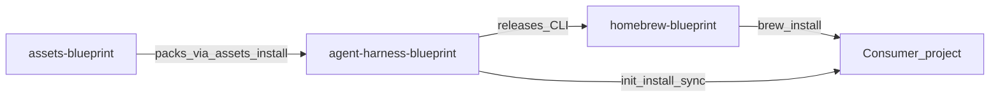
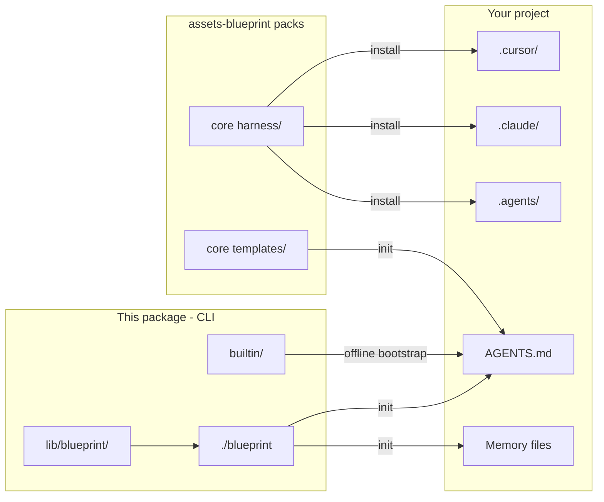

# Shared Agent Blueprints

Reusable multi-agent harness for **Cursor**, **Claude Code**, **OpenAI Codex**, and any tool that honors `AGENTS.md`.

This repository is the **CLI + runtime** only. Static packs and the Homebrew Formula live in sibling repos — see [Where content lives](#where-content-lives) and [docs/architecture-split.md](docs/architecture-split.md).

Adopting projects run `init` → `assets install core` → `install` before product work. Live `.cursor/` / `.claude/` / `.agents/` trees and task memory files belong in consumers only.

[](LICENSE)

---

## Where content lives

| Repo | Role | Edit here when… |
|------|------|-----------------|
| **This repo** — [agent-harness-blueprint](https://github.com/krerapus/agent-harness-blueprint) | CLI, projection runtime, `builtin/` bootstrap, `contributor/`, CLI releases | Changing install/sync/doctor/assets commands, release packaging, offline bootstrap |
| **[assets-blueprint](https://github.com/krerapus/assets-blueprint)** | Versioned packs (`core`, `prompts`, `memories`, `examples`) | Changing commands, rules, skills, blueprints, templates, prompts, examples |
| **[homebrew-blueprint](https://github.com/krerapus/homebrew-blueprint)** | Homebrew Formula only | Updating Formula urls / sha256 (usually via automated PR after a CLI release) |

In-tree `harness/`, `templates/`, `blueprints/`, `prompts/`, and `examples/` in this checkout are **legacy fallbacks** during the assets transition. Canonical edits belong in `assets-blueprint`.

## Why this project exists

Teams using AI coding agents need a **shared contract**: the same safety rails, planning memory, slash playbooks, and install path across tools—without copying one-off `.cursor/` trees into every repo.

This package keeps the CLI and projection runtime canonical, loads harness content from asset packs, and preserves local consumer overrides and memory state on sync.

## Features

- **Multi-runtime projection** — install into Cursor, Claude Code, Codex, or all (`--runtime`)
- **Blueprint profiles** — `default`, `engineering`, `product` (+ optional GitLab overlay) from the `core` pack
- **Managed consumer contract** — `HARNESS.md` + harness reference in `AGENTS.md` / `agents.md`
- **Preserve-local sync** — refreshes managed files without clobbering memory or agent bodies
- **Interactive TTY menu** — guided `init` / `install` / `sync` / `update` / `doctor` / `rm`
- **Asset manager** — install/update versioned packs from GitHub Releases or a local checkout
- **Remote source cache** — git URL sources resolve under `$XDG_CACHE_HOME/blueprint/repos/`

## How it works



Canonical harness content comes from packs (or a legacy in-tree fallback). Tool runtimes are projections. `AGENTS.md` is the shared contract every agent reads.



| Concept | Detail |
|---|---|
| CLI package | `blueprint`, `lib/blueprint/`, `builtin/`, `contributor/`, `VERSION` |
| Content packs | `assets-blueprint` → `core` / `prompts` / `memories` / `examples` |
| Consumer contract | `HARNESS.md`, `AGENTS.md` (+ thin `CLAUDE.md`) |
| Runtimes | `.cursor/`, `.claude/`, and/or `.agents/` from `--runtime` |

Deep dive: [docs/architecture.md](docs/architecture.md) · [docs/architecture-split.md](docs/architecture-split.md) · [docs/compatibility.md](docs/compatibility.md)

## How to use

### Installation

Requirements: Bash, Git, macOS or Linux.

**Homebrew (recommended):**

```bash
brew tap krerapus/blueprint
brew trust --formula krerapus/blueprint/blueprint   # Homebrew 6+/7, once
brew install krerapus/blueprint/blueprint
blueprint assets install core
```

**From a git checkout:**

```bash
git clone https://github.com/krerapus/agent-harness-blueprint.git
cd agent-harness-blueprint
ln -sf "$(pwd)/blueprint" /usr/local/bin/blueprint   # optional
blueprint assets install core
```

For local pack development, check out [`assets-blueprint`](https://github.com/krerapus/assets-blueprint) as a sibling (or set `BLUEPRINT_ASSETS_ROOT`).

Release docs: [docs/release.md](docs/release.md), [docs/homebrew.md](docs/homebrew.md), [docs/distribution.md](docs/distribution.md).

### Quick Start

```bash
blueprint doctor
blueprint init --target /path/to/your-repo
blueprint install default --runtime all --target /path/to/your-repo
blueprint doctor --target /path/to/your-repo
```

Then open the consumer repo in Cursor or Claude Code and start with `/start`.

Interactive menu (TTY): `blueprint` or `blueprint menu --target /path/to/your-repo`.

Step-by-step: [docs/setup.md](docs/setup.md)

### Configuration

After `init`, the consumer gets:

| File | Role |
|---|---|
| `.agent-blueprint.yaml` | Installed blueprint, runtime, optional remote `source` |
| `.agent-blueprint.local.yaml` | Local overrides (gitignored stub) |
| `HARNESS.md` | Managed harness entry (refreshed by `update`) |
| `AGENTS.md` / `agents.md` | Agent contract + managed harness reference block |

`--runtime`: `cursor` | `claude` | `codex` | `all`. Omit for an interactive selector.

Remote `source` git URLs are cached under `$XDG_CACHE_HOME/blueprint/repos/`. Details: [docs/harness-ownership.md](docs/harness-ownership.md)

### CLI usage

```text
Usage: blueprint [<command>] [blueprint] [flags]

Commands:
  (none) / menu        Interactive menu (TTY)
  init                 Write HARNESS.md + agent harness reference, memory, .gitignore
  install <blueprint>  Install blueprint into --target runtimes
  install-contributor  Project package-only contributor harness (this package root)
  update               Version check, then refresh HARNESS.md + managed runtimes
  sync                 Re-apply installed blueprint with preserve-local
  rm / del             Remove blueprint from --target
  doctor               Validate package + target install health
  assets …             list | install | update | doctor for content packs

Blueprints:  default | engineering | product

Flags:
  --overlay gitlab     Install GitLab/glab command overlay
  --runtime NAME       cursor | claude | codex | all
  --skill-mode MODE    rebase | merge (default rebase)
  --target PATH        Consumer project root
  --dry-run            Print actions without writing
  --force              Overwrite unmanaged files; required for non-interactive rm/del
```

| Step | Result |
|---|---|
| `assets install core` | Fetches/mounts the `core` pack (required before meaningful `install` on Release/Homebrew installs) |
| `init` | `HARNESS.md`, agent harness reference, memory skeletons, managed `.gitignore` — **no** tool runtime yet |
| `install` | Projects commands/rules/skills into `.cursor/`, `.claude/`, and/or `.agents/` |
| `install-contributor` | Package-only: projects `contributor/` + `skill-creator` into gitignored local runtimes |
| `update` | Version check vs package `VERSION`, refresh `HARNESS.md`, apply skill/rule renames |
| `sync` | Re-applies the installed blueprint (`preserve-local`) |
| `del` | Removes managed blueprint + memory files; keeps custom skills and agent instruction bodies |

History is stored under `$XDG_DATA_HOME/blueprint/history.jsonl` (no secrets).

### Examples

```bash
blueprint install default --runtime all --target ~/code/my-app
blueprint install default --runtime cursor --skill-mode merge --target ~/code/my-app
blueprint install engineering --overlay gitlab --runtime all --target ~/code/my-app
blueprint install product --runtime cursor --target ~/code/my-app
blueprint switch engineering --target ~/code/my-app
blueprint install default --runtime codex --target ~/code/my-app
blueprint sync --target ~/code/my-app
blueprint update --target ~/code/my-app
```

| Blueprint | Use when |
|---|---|
| `default` | Any repo — start/review, safety, core skills |
| `engineering` | Commit/refactor/ADR workflows |
| `product` | PRD/ADR-heavy early product discovery (formerly `startup`) |

After install: orient → `/start` → plan → execute → update memory → ship → learn. See [docs/harness-workflow.md](docs/harness-workflow.md).

### Uninstall

```bash
blueprint rm --target /path/to/your-repo
blueprint rm --force --target /path/to/your-repo   # non-interactive / CI
rm -f /usr/local/bin/blueprint                     # if you added a PATH symlink
```

`rm` / `del` does not rewrite `AGENTS.md` / `CLAUDE.md` bodies.

## How to update source

### Refresh consumers after a CLI or pack change

```bash
# CLI checkout
git pull
blueprint update --target /path/to/your-repo
# or
blueprint sync --target /path/to/your-repo

# Pack updates (from assets-blueprint Releases)
blueprint assets update core
```

### Edit the right repo

| Change | Repo | Notes |
|--------|------|-------|
| CLI behavior, assets manager, projection | **this repo** | `blueprint`, `lib/blueprint/`; bump [`VERSION`](VERSION) |
| Offline bootstrap templates | **this repo** | `builtin/` |
| Contributor commit/PR playbooks | **this repo** | `contributor/` |
| Skills, rules, commands, blueprints, templates | **[assets-blueprint](https://github.com/krerapus/assets-blueprint)** | `packs/core/…`; bump pack + `catalog.yaml` |
| Prompts / memories / examples | **assets-blueprint** | matching pack |
| Homebrew Formula | **[homebrew-blueprint](https://github.com/krerapus/homebrew-blueprint)** | usually auto-PR after CLI release |

Verify CLI changes: `./tests/cli/smoke.sh`, `./tests/cli/harness.sh`, `./blueprint doctor`.

Distribution: [docs/release.md](docs/release.md) → GitHub Release → Formula bump ([docs/homebrew.md](docs/homebrew.md)).

See [CONTRIBUTING.md](CONTRIBUTING.md).

## Troubleshooting

| Symptom | What to try |
|---|---|
| `doctor` / install missing harness | `blueprint assets install core` (or sibling `assets-blueprint` / `BLUEPRINT_ASSETS_ROOT`) |
| `doctor` fails on package | Run from the package root; ensure `VERSION`, `manifest.yaml`, and `lib/blueprint/` are present |
| `install` asks for runtime in CI | Pass `--runtime cursor\|claude\|codex\|all` explicitly |
| Target must not be this package | Point `--target` at a **consumer** repo, not this checkout |
| Conflicts (`*.blueprint-conflict`) | Compare sibling files; merge manually; re-run with `--force` |
| Leftover backups (`*.blueprint-backup.*`) | `./blueprint clean --force --target …` |
| Stale remote blueprint | `sync` again, or clear `$XDG_CACHE_HOME/blueprint/repos/` |
| Interrupted install/sync | Re-run; resume state under consumer `.agent-blueprint/` |

More: [docs/setup.md](docs/setup.md) · [docs/how-it-works.md](docs/how-it-works.md)

## Testing

```bash
./tests/cli/smoke.sh
./tests/cli/harness.sh
./blueprint doctor
./blueprint assets doctor --offline
```

## Roadmap

- Richer `doctor` diagnostics for remote cache and overlay drift
- Additional forge overlays beyond GitLab
- Retire in-tree legacy `harness/` / `templates/` / `blueprints/` mirrors once packs are universal
- More `good first issue` labeled tasks for community contributors

Ideas: [GitHub Issues](https://github.com/krerapus/agent-harness-blueprint/issues).

## Contributing

See [CONTRIBUTING.md](CONTRIBUTING.md). Follow the [Code of Conduct](CODE_OF_CONDUCT.md).

## Docs index

| Category | Doc |
|---|---|
| Ownership / split | [architecture-split.md](docs/architecture-split.md) |
| Architecture | [architecture.md](docs/architecture.md), [compatibility.md](docs/compatibility.md), [harness-ownership.md](docs/harness-ownership.md) |
| Setup | [setup.md](docs/setup.md), [local-development.md](docs/local-development.md), [adoption-and-lineage.md](docs/adoption-and-lineage.md) |
| How it works | [how-it-works.md](docs/how-it-works.md), [skills.md](docs/skills.md), [rules.md](docs/rules.md), [slash-commands.md](docs/slash-commands.md) |
| Workflow | [harness-workflow.md](docs/harness-workflow.md), [quick-start.md](docs/quick-start.md), [memory-and-planning.md](docs/memory-and-planning.md) |
| Release | [release.md](docs/release.md), [distribution.md](docs/distribution.md), [homebrew.md](docs/homebrew.md) |
| Community | [CONTRIBUTING.md](CONTRIBUTING.md), [SECURITY.md](SECURITY.md), [CHANGELOG.md](CHANGELOG.md), [github-labels.md](docs/github-labels.md) |
| Index | [docs/README.md](docs/README.md) |

## Layout

```text
.
├── blueprint            # CLI entry
├── lib/blueprint/       # CLI modules (assets, harness, XDG, …)
├── builtin/             # Offline bootstrap shipped with the CLI
├── contributor/         # Package-only commit/PR/skill standards
├── docs/                # CLI + projection + release docs
├── tests/cli/           # CLI smoke tests
├── scripts/             # package-release, verify, bump-homebrew-formula
├── VERSION              # CLI semver only
├── harness/             # LEGACY fallback — prefer assets-blueprint packs/core
├── templates/           # LEGACY fallback — prefer packs/core
├── blueprints/          # LEGACY fallback — prefer packs/core
├── prompts/             # LEGACY fallback — prefer packs/prompts
└── examples/            # LEGACY fallback — prefer packs/examples
```

## License

MIT © [Supparerk Arikarn](https://github.com/Supparerk23) — see [LICENSE](LICENSE).
