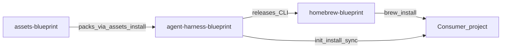
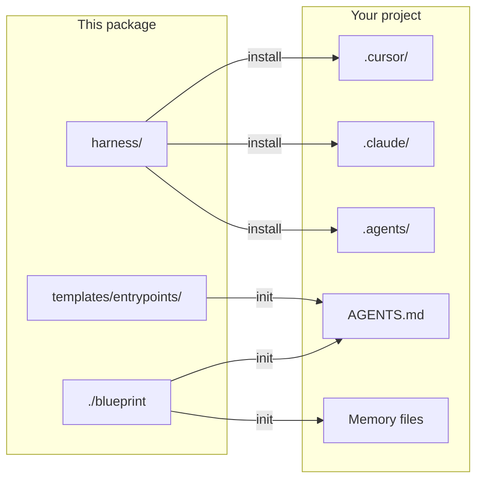

# Shared Agent Blueprints

Reusable multi-agent harness for **Cursor**, **Claude Code**, **OpenAI Codex**, and any tool that honors `AGENTS.md`.

This repository is the **CLI + runtime** (`agent-harness-blueprint`). Static packs live in [`assets-blueprint`](https://github.com/krerapus/assets-blueprint). Homebrew formula: [`homebrew-blueprint`](https://github.com/krerapus/homebrew-blueprint). See [docs/architecture-split.md](docs/architecture-split.md).

Adopting projects run `init` → `assets install core` (once) → `install` before product work. Live `.cursor/` / `.claude/` / `.agents/` trees and task memory files belong in consumers only.

[](LICENSE)

---

## Why this project exists

Teams using AI coding agents need a **shared contract**: the same safety rails, planning memory, slash playbooks, and install path across tools—without copying one-off `.cursor/` trees into every repo.

This package keeps harness sources canonical, projects them into tool runtimes on demand, and preserves local consumer overrides and memory state on sync.

## Features

- **Multi-runtime projection** — install into Cursor, Claude Code, Codex, or all (`--runtime`)
- **Blueprint profiles** — `default`, `engineering`, `startup` (+ optional GitLab overlay)
- **Managed consumer contract** — `HARNESS.md` + harness reference in `AGENTS.md` / `agents.md`
- **Preserve-local sync** — refreshes managed files without clobbering memory or agent bodies
- **Interactive TTY menu** — guided `init` / `install` / `sync` / `update` / `doctor` / `rm`
- **Remote source cache** — git URL sources resolve under `$XDG_CACHE_HOME/blueprint/repos/`
- **Docs + skills** — planning, review, commit, and specialized skill packs under `harness/`

## How it works

This repo is the **CLI + runtime**. Static packs live in [`assets-blueprint`](https://github.com/krerapus/assets-blueprint). Homebrew Formula lives in [`homebrew-blueprint`](https://github.com/krerapus/homebrew-blueprint).



Canonical content lives under `harness/` (and/or installed asset packs). Tool runtimes are projections. `AGENTS.md` is the shared contract every agent reads.



| Concept | Detail |
|---|---|
| Package | `harness/`, `blueprints/`, `templates/`, `./blueprint` |
| Consumer contract | `AGENTS.md` (+ thin `CLAUDE.md`) |
| Runtimes | `.cursor/`, `.claude/`, and/or `.agents/` from `--runtime` |

Deep dive: [docs/architecture.md](docs/architecture.md) · [docs/architecture-split.md](docs/architecture-split.md) · [docs/compatibility.md](docs/compatibility.md)

## How to use

### Installation

Requirements: Bash, Git, macOS or Linux.

```bash
git clone https://github.com/krerapus/agent-harness-blueprint.git
cd agent-harness-blueprint

# Optional: put the CLI on PATH
ln -sf "$(pwd)/blueprint" /usr/local/bin/blueprint
```

There is a Homebrew tap: `krerapus/homebrew-blueprint` (tap name `krerapus/blueprint`).

```bash
brew tap krerapus/blueprint https://github.com/krerapus/homebrew-blueprint
brew install blueprint
blueprint assets install core
```

Release/distribution docs: [docs/release.md](docs/release.md), [docs/homebrew.md](docs/homebrew.md).

Until a `v*` GitHub Release with archives exists, install from a git checkout and symlink the `blueprint` executable, then:

```bash
blueprint assets install core
```

`scripts/agent` remains a back-compat shim that forwards to `./blueprint`.

### Quick Start

Under 60 seconds from a package checkout:

```bash
./blueprint doctor
./blueprint init --target /path/to/your-repo
./blueprint install default --runtime all --target /path/to/your-repo
./blueprint doctor --target /path/to/your-repo
```

Example output shape:

```text
✓ package OK
✓ wrote HARNESS.md
✓ projected harness → .cursor/ .claude/ .agents/
✓ target healthy
```

Then open the consumer repo in Cursor or Claude Code and start with `/start`.

Interactive menu (TTY):

```bash
./blueprint
# or
./blueprint menu --target /path/to/your-repo
```

Step-by-step checklist: [docs/setup.md](docs/setup.md)

### Configuration

After `init`, the consumer gets:

| File | Role |
|---|---|
| `.agent-blueprint.yaml` | Installed blueprint, runtime, optional remote `source` |
| `.agent-blueprint.local.yaml` | Local overrides (gitignored stub) |
| `HARNESS.md` | Managed harness entry (refreshed by `update`) |
| `AGENTS.md` / `agents.md` | Agent contract + managed harness reference block |

`--runtime`: `cursor` | `claude` | `codex` | `all`. Omit for an interactive selector.

Remote `source` git URLs are cached under `$XDG_CACHE_HOME/blueprint/repos/`. Details: [docs/harness-ownership.md](docs/harness-ownership.md)

### CLI usage

```text
Usage: blueprint [<command>] [blueprint] [flags]

Commands:
  (none) / menu        Interactive menu (TTY)
  init                 Write HARNESS.md + agent harness reference, memory, .gitignore
  install <blueprint>  Install blueprint into --target runtimes
  install-contributor  Project package-only contributor harness (this package root)
  update               Version check, then refresh HARNESS.md + managed runtimes
  sync                 Re-apply installed blueprint with preserve-local
  rm / del             Remove blueprint from --target
  doctor               Validate package + target install health

Blueprints:  default | engineering | startup

Flags:
  --overlay gitlab     Install GitLab/glab command overlay
  --runtime NAME       cursor | claude | codex | all
  --skill-mode MODE    rebase | merge (default rebase)
  --target PATH        Consumer project root
  --dry-run            Print actions without writing
  --force              Overwrite unmanaged files; required for non-interactive rm/del
```

| Step | Result |
|---|---|
| `init` | `HARNESS.md`, agent harness reference, memory skeletons, managed `.gitignore` — **no** tool runtime yet |
| `install` | Projects commands/rules/skills into `.cursor/`, `.claude/`, and/or `.agents/`; writes managed `.gitignore` for `--skill-mode rebase` (whole runtime dirs) or `merge` (blueprint skills/commands/rules/templates only) |
| `install-contributor` | Package-only: projects `contributor/` + `skill-creator` into gitignored local runtimes |
| `update` | Version check vs package `VERSION`, refresh `HARNESS.md`, apply skill/rule renames, full-refresh managed skills/rules — never rewrites agent instruction files |
| `sync` | Re-applies the installed blueprint (`preserve-local`); may fetch a remote `source` |
| `del` | Removes managed blueprint + memory files; keeps custom skills and agent instruction bodies (`rm` is an alias) |

History is stored under `$XDG_DATA_HOME/blueprint/history.jsonl` (no secrets).

### Examples

```bash
# Core harness for any repo
./blueprint install default --runtime all --target ~/code/my-app

# Ignore only blueprint-projected files so local skills can be committed
./blueprint install default --runtime cursor --skill-mode merge --target ~/code/my-app

# Engineering workflows + GitLab MR playbooks
./blueprint install engineering --overlay gitlab --runtime all --target ~/code/my-app

# Startup / PRD-heavy profile
./blueprint install startup --runtime cursor --target ~/code/my-app

# Codex only (skills under .agents/skills/)
./blueprint install default --runtime codex --target ~/code/my-app

# Refresh later
./blueprint sync --target ~/code/my-app
./blueprint update --target ~/code/my-app

# Preview without writing
./blueprint install default --runtime all --target ~/code/my-app --dry-run
```

| Blueprint | Use when |
|---|---|
| `default` | Any repo — start/review, safety, core skills |
| `engineering` | Commit/refactor/ADR workflows |
| `startup` | PRD/ADR-heavy early product work |

Example consumer layout: [examples/consumer/](examples/consumer/)

After install, the delivery loop is: orient → `/start` → plan → execute → update memory → ship → learn. See [docs/harness-workflow.md](docs/harness-workflow.md).

### Uninstall

From a consumer project:

```bash
./blueprint rm --target /path/to/your-repo           # interactive confirm (alias: del)
./blueprint rm --force --target /path/to/your-repo  # non-interactive / CI
```

Remove the PATH symlink if you added one:

```bash
rm -f /usr/local/bin/blueprint
```

Optionally delete the package checkout. `rm` / `del` does not rewrite `AGENTS.md` / `CLAUDE.md` bodies.

## How to update source

### Refresh consumers after pulling this package

```bash
cd /path/to/agent-harness-blueprint
git pull

# Refresh managed files in each consumer
./blueprint update --target /path/to/your-repo
# or re-apply projections while preserving local memory
./blueprint sync --target /path/to/your-repo
```

### Edit this package

```bash
git clone https://github.com/krerapus/agent-harness-blueprint.git
cd agent-harness-blueprint
./blueprint doctor
```

| Path | Purpose |
|---|---|
| `harness/` | Canonical commands, rules, skills (legacy during assets transition — prefer [`assets-blueprint`](https://github.com/krerapus/assets-blueprint) packs) |
| `blueprints/` | Profiles (`default`, `engineering`, `startup`) |
| `templates/` | Entrypoints, memory, PRD/ADR |
| `lib/blueprint/` | CLI modules (assets, harness, XDG, …) |
| `builtin/` | Offline bootstrap shipped with the CLI |
| `contributor/` | Package-only commit/PR/skill standards |
| `prompts/` | Prompt library (legacy; prefer assets `prompts` pack) |
| `tests/cli/` | Smoke and harness tests |
| `VERSION` | **Only** place to bump CLI semver |

Checklist:

1. Change CLI behavior under `blueprint` / `lib/blueprint/`, or content under `harness/` / templates / blueprints (or the sibling assets pack).
2. Bump [`VERSION`](VERSION) when releasing the CLI; update [CHANGELOG.md](CHANGELOG.md).
3. Run `./tests/cli/smoke.sh`, `./tests/cli/harness.sh`, and `./blueprint doctor`.
4. For distribution: [docs/release.md](docs/release.md) → GitHub Release → formula bump on [`homebrew-blueprint`](https://github.com/krerapus/homebrew-blueprint) ([docs/homebrew.md](docs/homebrew.md)).
5. For pack content owned by assets: edit [`assets-blueprint`](https://github.com/krerapus/assets-blueprint) and publish pack tags; consumers run `blueprint assets update`.

See [CONTRIBUTING.md](CONTRIBUTING.md) and [AGENTS.md](AGENTS.md).

## Troubleshooting

| Symptom | What to try |
|---|---|
| `doctor` fails on package | Run from the package root; ensure `VERSION`, `manifest.yaml`, and `harness/` are present |
| `install` asks for runtime in CI | Pass `--runtime cursor\|claude\|codex\|all` explicitly |
| Target must not be this package | Point `--target` at a **consumer** repo, not this checkout |
| Conflicts (`*.blueprint-conflict`) | Compare sibling files; merge manually; re-run with `--force` to overwrite; interactive update/sync also prompts to apply package versions |
| Leftover backups (`*.blueprint-backup.*`) | After review, `./blueprint clean --force --target …` (or menu `clean` / Known projects → `clean`). Status `*` means clean is needed |
| Stale remote blueprint | `sync` again, or clear `$XDG_CACHE_HOME/blueprint/repos/` and retry |
| Interrupted install/sync | Re-run the same command; resume state lives under consumer `.agent-blueprint/` |
| Menu has no targets | Add a path when prompted; package-local `targets.json` is gitignored |

More detail: [docs/setup.md](docs/setup.md) · [docs/how-it-works.md](docs/how-it-works.md)

## Testing

```bash
./tests/cli/smoke.sh
./tests/cli/harness.sh
./blueprint doctor
```

## Roadmap

- Packaged distribution (Homebrew and/or release binaries)
- Richer `doctor` diagnostics for remote cache and overlay drift
- Additional forge overlays beyond GitLab
- More `good first issue` labeled tasks for community contributors

Ideas welcome via [GitHub Issues](https://github.com/krerapus/agent-harness-blueprint/issues).

## Contributing

Contributions are welcome. See [CONTRIBUTING.md](CONTRIBUTING.md) for setup, branch naming, commits, PRs, how to update source, and testing. Everyone is expected to follow the [Code of Conduct](CODE_OF_CONDUCT.md).

## Docs index

| Category | Doc |
|---|---|
| Architecture | [architecture.md](docs/architecture.md), [architecture-split.md](docs/architecture-split.md), [compatibility.md](docs/compatibility.md), [harness-ownership.md](docs/harness-ownership.md) |
| Setup | [setup.md](docs/setup.md), [adoption-and-lineage.md](docs/adoption-and-lineage.md) |
| How it works | [how-it-works.md](docs/how-it-works.md), [skills.md](docs/skills.md), [rules.md](docs/rules.md), [slash-commands.md](docs/slash-commands.md) |
| Workflow | [harness-workflow.md](docs/harness-workflow.md), [quick-start.md](docs/quick-start.md), [memory-and-planning.md](docs/memory-and-planning.md) |
| Release | [release.md](docs/release.md), [distribution.md](docs/distribution.md), [homebrew.md](docs/homebrew.md) |
| Community | [CONTRIBUTING.md](CONTRIBUTING.md), [SECURITY.md](SECURITY.md), [CHANGELOG.md](CHANGELOG.md), [github-labels.md](docs/github-labels.md) |
| Index | [docs/README.md](docs/README.md) |

## Layout

```text
.
├── harness/             # canonical commands, rules, skills (consumer)
├── contributor/         # package-only commit/PR/skill standards
├── blueprints/          # default | engineering | startup
├── templates/           # entrypoints + memory + PRD/ADR
├── builtin/             # offline bootstrap
├── lib/blueprint/       # CLI modules
├── prompts/             # prompt library
├── docs/                # diagrams + deep docs
├── tests/cli/           # CLI smoke tests
├── blueprint            # CLI: init | install | install-contributor | sync | doctor
└── examples/consumer/   # example consumer install state
```

## License

MIT © [Supparerk Arikarn](https://github.com/Supparerk23) — see [LICENSE](LICENSE).
