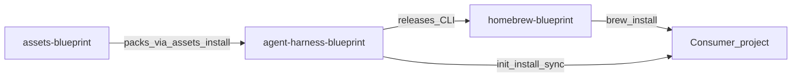

# Three-repo split — what lives where

Blueprint is three repositories. Edit content in the repo that owns it; do not duplicate ownership across repos.

## Ownership map

| Repo | Owns | Does **not** own |
|------|------|------------------|
| **[agent-harness-blueprint](https://github.com/krerapus/agent-harness-blueprint)** (this repo) | CLI (`blueprint`, `lib/blueprint/`), offline `builtin/` bootstrap, `contributor/` tooling, CLI `VERSION`, release packaging / CI, CLI + projection docs | Pack versioning, Homebrew Formula text |
| **[assets-blueprint](https://github.com/krerapus/assets-blueprint)** | Versioned packs: `core`, `prompts`, `memories`, `examples` (`catalog.yaml`, pack tags / Release assets) | CLI binary, Homebrew Formula |
| **[homebrew-blueprint](https://github.com/krerapus/homebrew-blueprint)** | `Formula/blueprint.rb` only (urls, sha256, libexec layout) | CLI source, pack contents |



## Stay in this repo (`agent-harness-blueprint`)

| Path / concern | Why it stays here |
|----------------|-------------------|
| `blueprint`, `lib/blueprint/` | Runtime: install, sync, assets manager, XDG, projection |
| `builtin/` | Offline bootstrap (entrypoints + memory skeletons shipped with the CLI) |
| `contributor/` | Package-only commit/PR/skill-creator playbooks |
| `VERSION` | **Only** place to bump CLI semver |
| `scripts/package-release.sh`, `scripts/verify-release-archive.sh`, `scripts/bump-homebrew-formula.sh` | Produce GitHub Release archives and Formula PRs |
| `.github/workflows/cli-release.yml` | Tag → test → package → Release → optional Formula bump |
| `docs/` about CLI, projection, release, distribution | How the runtime behaves |
| `tests/cli/` | CLI smoke / harness ownership tests |
| `manifest.yaml` | CLI package metadata |

CLI release archives contain `blueprint`, `VERSION`, `LICENSE`, `README.md`, `lib/`, `builtin/`, and optional `contributor/`. They do **not** bottle pack content.

## Stay in `assets-blueprint`

| Pack | Path | Contents |
|------|------|----------|
| `core` | `packs/core/` | `harness/` (commands, rules, skills, migrations), `templates/`, `blueprints/` |
| `prompts` | `packs/prompts/` | Prompt library |
| `memories` | `packs/memories/` | Root memory skeleton templates |
| `examples` | `packs/examples/` | Consumer examples |

Also: `catalog.yaml`, `scripts/package-pack.sh`, pack release workflow / tags (`core-vX.Y.Z`, …), and pack-author docs under [`docs/`](https://github.com/krerapus/assets-blueprint/tree/master/docs) (skills inventory + skill-naming standard).

**Edit harness content, blueprints, consumer entrypoint templates, prompts, and examples there** — then bump the pack version and catalog. Consumers refresh with `blueprint assets update`.

## Stay in `homebrew-blueprint`

| Path | Why |
|------|-----|
| `Formula/blueprint.rb` | Version, per-platform `url` + `sha256`, `libexec` install |

Never vendor CLI `lib/`, packs, or source into the tap. Artifacts come from this repo’s GitHub Releases.

## Legacy copies still in this checkout (transition)

In-tree `harness/`, `templates/`, `blueprints/`, `prompts/`, and `examples/` may still exist as a **fallback** when no assets checkout/cache is available (`assets_resolve_pack` → legacy CLI tree).

| Rule | Detail |
|------|--------|
| Canonical edit location | [`assets-blueprint`](https://github.com/krerapus/assets-blueprint) packs |
| Do not treat legacy trees as SoT | Prefer packs; avoid divergent edits only in this repo |
| Homebrew / Release users | Must run `blueprint assets install core` (and other packs as needed) |
| Local pack dev | Sibling `../assets-blueprint` or `BLUEPRINT_ASSETS_ROOT` |

## Runtime flow

```text
CLI → Asset Manager → packs (sibling checkout / XDG cache / legacy tree)
                 ↓
            Projector → consumer .cursor / .claude / .agents
```

## Config / cache (XDG)

```text
~/.config/blueprint/     config.yaml, assets.yaml, credentials/, plugins/
~/.cache/blueprint/      assets/<pack>/<ver>/, downloads/, catalog/
~/.local/share/blueprint history.jsonl, targets.json
```

## Asset commands

```bash
blueprint assets list
blueprint assets install core
blueprint assets update core
blueprint assets doctor --offline
```

Dev: place `assets-blueprint` as a sibling of this repo, or set `BLUEPRINT_ASSETS_ROOT`.

## Related docs

- Local/dev testing: [local-development.md](local-development.md)
- Projection behavior: [architecture.md](architecture.md)
- Package vs consumer paths: [compatibility.md](compatibility.md)
- CLI release: [release.md](release.md) · [distribution.md](distribution.md) · [homebrew.md](homebrew.md)
