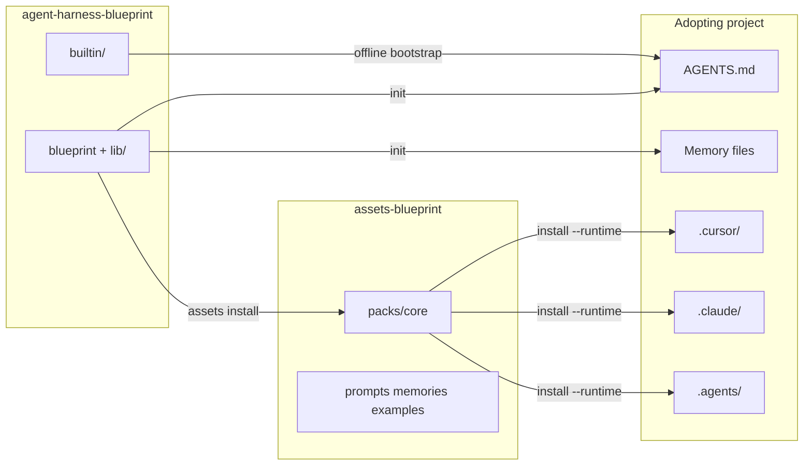
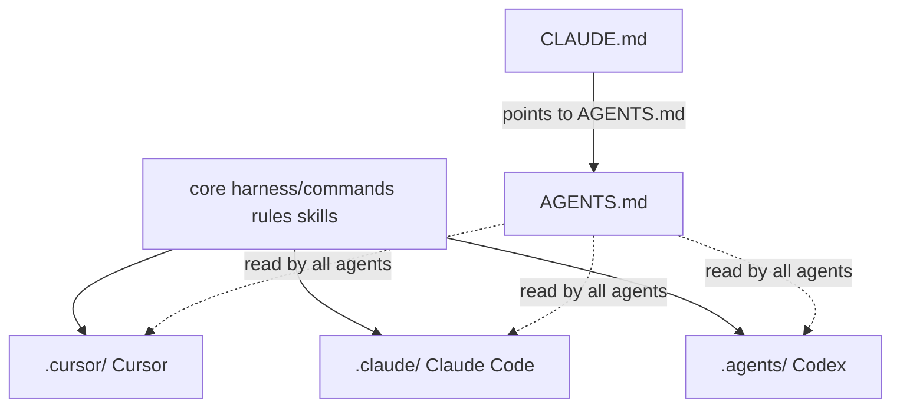

# Architecture

How the Blueprint CLI relates to asset packs, consuming projects, and AI tools.

For **which repo owns which files**, start with [architecture-split.md](architecture-split.md).

## Package vs packs vs consumer

## Source of truth

| Layer | Canonical location | Lands in consumer |
|---|---|---|
| Commands / rules / skills | `assets-blueprint` → `packs/core/harness/` | `.cursor/`, `.claude/`, and/or `.agents/` |
| Profiles / overlays | `packs/core/blueprints/` | Selected extras + overlays |
| Shared AI contract templates | `packs/core/templates/entrypoints/` (+ CLI `builtin/` offline) | `HARNESS.md`, `AGENTS.md` |
| Memory skeletons | `packs/core/templates/memory/` / `packs/memories/` | `PLANNING.md`, … (once; never overwritten) |
| Prompts | `packs/prompts/` | Optional / tooling use |
| CLI + projection | this repo (`blueprint`, `lib/`, `builtin/`) | — |

During transition, an in-tree `harness/` (etc.) in this repo may still resolve as a **legacy fallback** if no pack is installed. Prefer editing packs.

Tool dirs are adapters, not forks: edit the pack, then `install` / `sync` / `assets update`.

## Multi-runtime projection

| Source (under resolved core pack) | Cursor | Claude Code | Codex |
|---|---|---|---|
| `harness/commands/*.md` | `.cursor/commands/` | `.claude/commands/` | `.agents/commands/` |
| `harness/skills/*/` | `.cursor/skills/` | `.claude/skills/` | `.agents/skills/` |
| `harness/rules/*.mdc` | `.cursor/rules/*.mdc` | `.claude/rules/*.md` | `.agents/rules/*.md` |
| Workflow templates (`adr`, `prd`, …) | `.cursor/templates/` | `.claude/templates/` | `.agents/templates/` |

Codex discovers repository skills from `.agents/skills/` ([Codex skills](https://developers.openai.com/codex/skills)). Playbooks under `.agents/commands/` are the same files as other runtimes; Codex does not treat them as slash commands — invoke via `$skill-name` or `AGENTS.md` / `HARNESS.md`.

`--runtime all` projects all three trees. Cursor also loads `.agents/skills/` and `.claude/skills/` for compatibility, so skills can appear more than once when multiple runtimes are installed.

See also [compatibility.md](compatibility.md) and [architecture-split.md](architecture-split.md).
