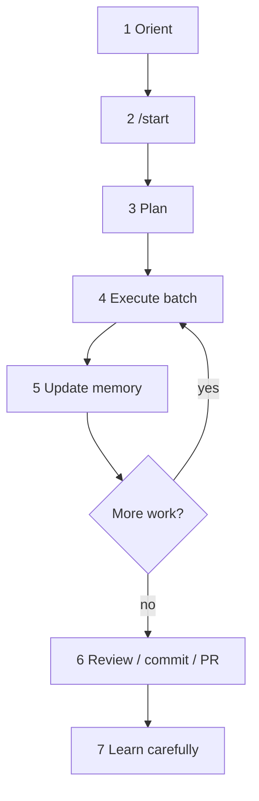
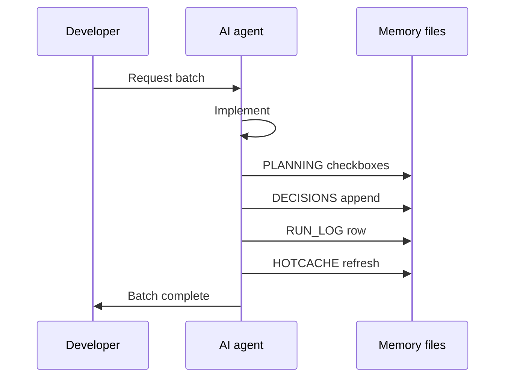
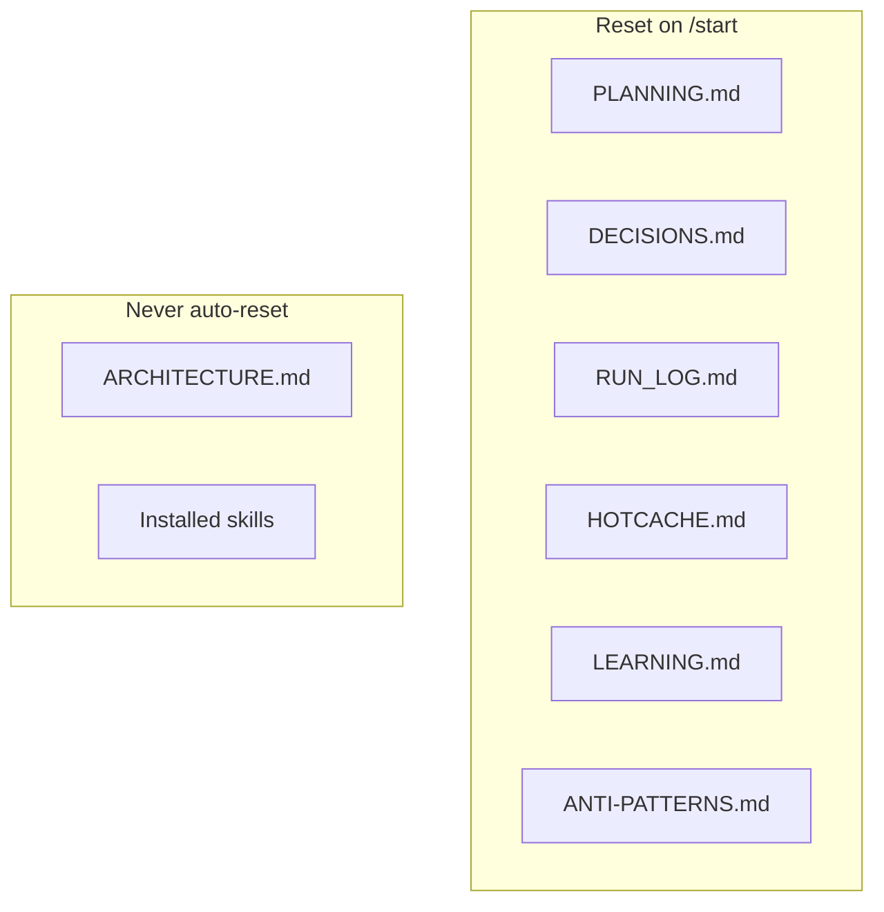

# Harness workflow

Step-by-step AI delivery loop once the blueprint is installed in a consumer repo.

## End-to-end

## Steps

### 1. Orient

Read root `HARNESS.md` first for lifecycle and gates (template SoT: [`assets-blueprint` packs/core/templates/entrypoints/HARNESS.md](https://github.com/krerapus/assets-blueprint/blob/master/packs/core/templates/entrypoints/HARNESS.md); projected on `init`), then `AGENTS.md`, then local overrides, then rules/skills relevant to the task.

### 2. `/start`

Create a `feature/` or `hotfix/` branch and reset **task-scoped** memory templates from the active runtime skills:

- planning skill → `PLANNING.md`, `DECISIONS.md`, `RUN_LOG.md`
- memory skill → `HOTCACHE.md`, `ANTI-PATTERNS.md`, `LEARNING.md`

Do **not** reset `ARCHITECTURE.md` or installed skill trees.

See [quick-start.md](quick-start.md).

### 3. Plan

Keep goals and checklists truthful in `PLANNING.md` (`## Goal`, task list, `## Context for AI`).

### 4. Execute in batches

Implement a coherent slice of work. Prefer existing project patterns; confirm before destructive Git/DB/infra operations.

### 5. Update memory together

After each batch, update all of:

| File | Update |
|---|---|
| `PLANNING.md` | Checkboxes / `## ✅ Done` |
| `DECISIONS.md` | What changed and why |
| `RUN_LOG.md` | One telemetry row only |
| `HOTCACHE.md` | Replace stale operational scratch |

### 6. Review / ship

Use `/review`, `/commit`, and forge commands (`/pr`, `/sync-dev`, …) when the overlay is installed.

### 7. Learn carefully

- Draft notes in `LEARNING.md` (not authoritative).
- Promote to skills/rules only after human review.
- Ban repeats in `ANTI-PATTERNS.md`.

## Memory map

Full layer semantics: [memory-and-planning.md](memory-and-planning.md).
