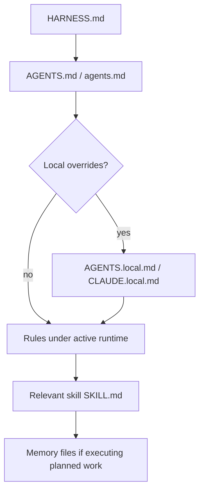
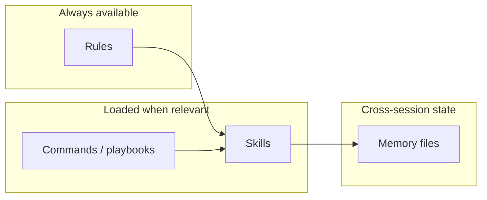
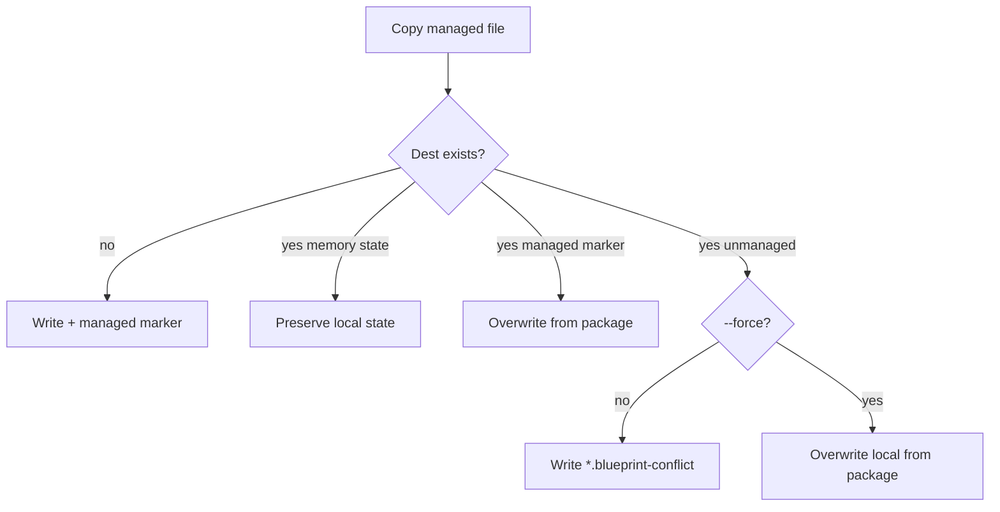

# How it works

Runtime behavior after a project has been initialized and installed.

## Read order (any agent)



Claude Code also loads root `CLAUDE.md`, which points at `AGENTS.md` first. `blueprint update` version-checks then refreshes managed blueprint context (`HARNESS.md` + runtimes); see [harness-ownership.md](harness-ownership.md).

## Layers



| Layer | Role | Typical path |
|---|---|---|
| **Commands** | Named playbooks (`/start`, `/review`, `/commit`, forge) | `<runtime>/commands/` |
| **Rules** | Always-on or path-scoped policy | `<runtime>/rules/` |
| **Skills** | Curated multi-step procedures | `<runtime>/skills/*/SKILL.md` |
| **Memory** | Planning, decisions, telemetry, scratch | Repo root `*.md` |

`<runtime>` is `.cursor`, `.claude`, or `.agents`.

## Install / sync conflict policy



Local overrides (`*.local.md`, `*.local.mdc`, `.agent-blueprint.local.yaml`) always win.

`--skill-mode rebase` (default) gitignores entire `.cursor/` / `.claude/` / `.agents/`. `--skill-mode merge` gitignores only the skills, commands, rules, and templates this blueprint projected, so local files in those runtimes can be committed. `sync` / `update` reuse stored `skill_mode`.

`del` removes blueprint-projected skills/commands/rules/templates only. Custom user skills and other non-blueprint files under `.cursor/` / `.claude/` / `.agents/` stay; empty runtime directories are pruned.

On install/sync/update, unresolved conflicts emit a **project-level warning** (project name + count). In an interactive TTY, the CLI also offers to overwrite locals from the `*.blueprint-conflict` siblings. Non-interactive runs leave locals intact unless you pass `--force`. Known targets prefix the Name with compact status icons (`✓` current, `↓` outdated, `!` conflicts, `*` leftover backups — run `blueprint clean`), colored to match. `doctor` lists unresolved conflict siblings and backups as warnings.

## Update loop

1. Edit package sources under `harness/` / `templates/` / `blueprints/`.
2. In the consumer: `./blueprint sync --dry-run`, review, then `sync`.
3. Run `./blueprint doctor --target .`.

When consumer state `source` is a git URL, `sync` / `install` fetch or update a local cache (`$XDG_CACHE_HOME/blueprint/repos/`) before copying. Status symbols (`→` `✓` `!` `✗` `⊘` `~` `+`) stream per file; a final summary reports added / updated / skipped / failed counts and a run ID.

Interrupted operations leave `.agent-blueprint/session.json` in the consumer. The next interactive `install` / `sync` offers resume; non-interactive runs start fresh unless `BLUEPRINT_RESUME=1`.

## Package contributor harness

Sources under `contributor/` standardize commits, PRs, and skill creation **for this package only**. They are **not** copied by consumer `blueprint install`. Optional local IDE projection:

```bash
./blueprint install-contributor --runtime all
```

See [CONTRIBUTING.md](../CONTRIBUTING.md) and package-root [AGENTS.md](../AGENTS.md).

Details: [compatibility.md](compatibility.md), [slash-commands.md](slash-commands.md), [rules.md](rules.md), [skills.md](skills.md).
