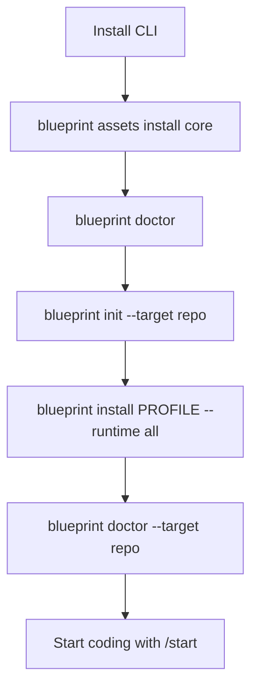
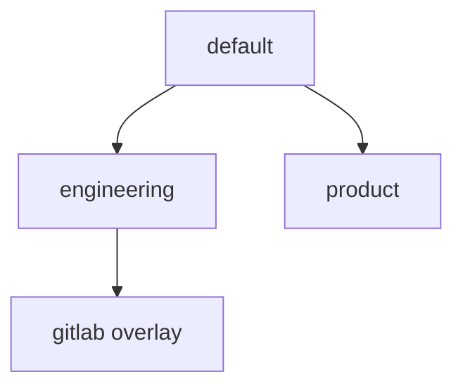

# Setup blueprint

Required steps before product work in any adopting repository.

## Install the CLI

**Homebrew:**

```bash
brew tap krerapus/blueprint
brew trust --formula krerapus/blueprint/blueprint   # Homebrew 6+/7, once
brew install krerapus/blueprint/blueprint
blueprint assets install core
```

**From a git checkout** of this repo:

```bash
ln -s /path/to/agent-harness-blueprint/blueprint /usr/local/bin/blueprint   # optional
blueprint assets install core
```

`assets install core` is required for Homebrew/Release installs (CLI archives do not include pack content). With a full git checkout that still has legacy `harness/`, the CLI may fall back to that tree if no pack is resolved — prefer packs. See [architecture-split.md](architecture-split.md).

## Flow



## Interactive menu

On a TTY, run with no command (or `menu`) for a guided UI:

```bash
blueprint
# or
blueprint menu --target /path/to/your-repo
```

Menu flow: set **target** first (any local path outside this package), then choose `init` / `install` (blueprint → overlay → runtime → skill-mode) / `sync` / `update` / `doctor`. Type `rm` or `del` (keyword only — no number) to remove the blueprint from the target. Press **Esc** on any selection screen to return to the previous state (from the command menu, Esc returns to the target picker).

Each mutating action clears the visible terminal once, renders a compact header, streams file events, and prints a summary. CI / non-TTY skips clear and animation.

## Commands

```bash
blueprint assets install core
blueprint doctor

# 1) Shared contract + memory only (no .cursor / .claude yet)
blueprint init --target /path/to/your-repo

# 2) Project harness into tool runtimes
blueprint install default --runtime all --target /path/to/your-repo

# Optional: commit local skills/commands while ignoring blueprint-projected files
blueprint install default --runtime all --skill-mode merge --target /path/to/your-repo

# Optional engineering + GitLab MR playbooks
blueprint install engineering --overlay gitlab --runtime all --target /path/to/your-repo

# Later: refresh managed HARNESS.md + runtimes
blueprint update --target /path/to/your-repo

# Later: refresh runtime projections without clobbering local memory / agent files
blueprint sync --target /path/to/your-repo

# Remove blueprint from a target
blueprint rm --target /path/to/your-repo
blueprint rm --force --target /path/to/your-repo
```

File ownership for `HARNESS.md` vs agent instruction files: **[harness-ownership.md](harness-ownership.md)**.

## What each step writes

| Step | Writes | Does not write |
|---|---|---|
| `assets install` | Pack cache under `~/.cache/blueprint/` (or uses sibling checkout) | Consumer project files |
| `init` | `HARNESS.md`, compact harness reference in the selected root instruction file (`AGENTS.md` / `agents.md` / `CLAUDE.md` / `claude.md`, or create `AGENTS.md`), memory skeletons, managed `.gitignore` section, `.agent-blueprint.yaml`, local override stub | `.cursor/`, `.claude/`, `.agents/`; never auto-creates `CLAUDE.md` |
| `install` | Selected blueprint into `--runtime` roots; managed `.gitignore` for `--skill-mode rebase` (entire `.cursor/` / `.claude/` / `.agents/`) or `merge` (only blueprint skills/commands/rules/templates); preserves agent instruction files | Existing memory file **content**; root `AGENTS.md` / `agents.md` / `CLAUDE.md` / `claude.md` |
| `update` | Version check; refresh `HARNESS.md`; apply `harness/migrations/renames.log` (remove old skill/rule paths); full-refresh package skills/rules into declared runtimes; stamp state version | Agent instruction files (`AGENTS.md` / `agents.md` / `CLAUDE.md` / `claude.md`) |
| `sync` | Re-applies installed blueprint + runtimes (`preserve-local`); may fetch remote `source` into `$XDG_CACHE_HOME/blueprint/repos/` | Unmanaged / local overrides; agent instruction files |
| `rm` / `del` | Removes managed harness/state/gitignore section, memory files, harness reference block, and **blueprint-projected** skills/commands/rules/templates | `AGENTS.md` / `agents.md` / `CLAUDE.md` / `claude.md` bodies; local overrides; **custom skills** and other non-blueprint files under `.cursor/` / `.claude/` / `.agents/` |

`--runtime`: `cursor` | `claude` | `codex` | `all`. If omitted, `install` shows an interactive selector (each tool is optional). Non-interactive shells auto-pick from PATH or require `--runtime`.

`--skill-mode`: `rebase` (default) ignores the whole runtime directories; `merge` ignores only the skills, commands, rules, and templates this blueprint projects, so local files under `.cursor/` / `.claude/` / `.agents/` stay commitable. Interactive `install` prompts for the mode after runtime. `sync` / `update` reuse the stored `skill_mode` unless you pass the flag again.

## Remote source

When `.agent-blueprint.yaml` `source` is a git URL (`https://…`, `git@…`, `file://…`, …), `install` / `sync` clone or update a cache under `$XDG_CACHE_HOME/blueprint/repos/<hash>/`, then copy from that cache. Bare names and local package checkouts keep copying from the directory that contains the `blueprint` executable.

Credentials are never printed; interrupted runs store resume state under `.agent-blueprint/` in the consumer (gitignored).

Interactive `blueprint` remembers consumer targets under `$XDG_DATA_HOME/blueprint/targets.json` (with a legacy package-local `targets.json` fallback). That file is gitignored and must not be committed.

## Blueprints



| Name | Adds |
|---|---|
| `default` | Core harness |
| `engineering` | Commit / review depth + optional forge overlay |
| `product` | PRD / ADR templates (formerly `startup`) |

Profiles ship in the `core` pack (`assets-blueprint`), not in the CLI release archive.

## Checklist

- [ ] `blueprint assets install core`
- [ ] `blueprint doctor` on the package
- [ ] `blueprint init --target <repo>`
- [ ] `blueprint install … --runtime … --target <repo>`
- [ ] `blueprint doctor --target <repo>`
- [ ] Start product work with `/start`

Smoke tests: `./tests/cli/smoke.sh` · harness tests: `./tests/cli/harness.sh`
